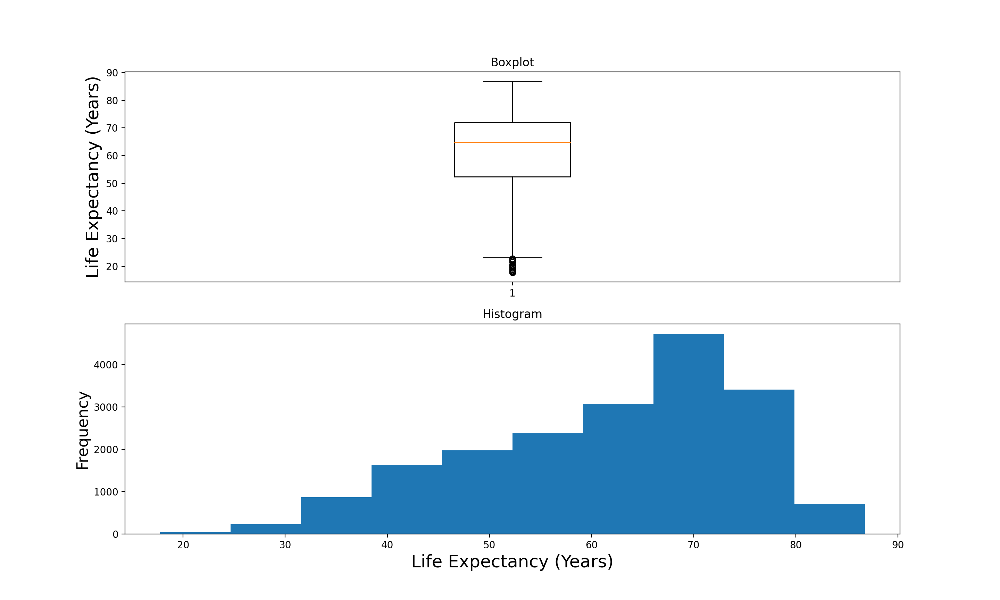
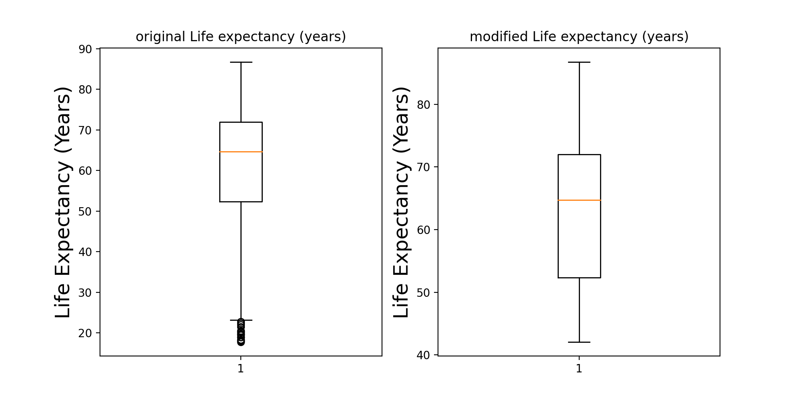

# Data Challenge - Life Expectancy

The documentation is written as follows.

The first section discusses the packages needed for running the modules. Next, an example usage is shown.
Following which the data cleaning is discussed and finally the data exploration.

## Installation

Use the package manager [pip](https://pip.pypa.io/en/stable/) to install foobar.

```bash
pip install pandas
pip install numpy
pip install scipy
pip install matplotlib
```
Pandas, numpy, scipy.stats and matplotlib.pyplot are used in the module.

## Usage

You will be presented with the following prompts to input the year range and entity values. The code checks the sanity
of the entered year values. Here is the sample output of the module with several queries for the year range provided.
1970 to 1996.

```python

----------------------------------------------------------------------------------------------
1 column 'Code' contains null values equal to 583
1 columns contain null values; 4 is the total number of columns
----------------------------------------------------------------------------------------------
----------------------------------------------------------------------------------------------
Outliers: 16
Outlier Percent: 0.08%
----------------------------------------------------------------------------------------------
Hello we will ask you to input a few values to get the module started
Please input the starting year
1970
Please input the ending year
1996
Please input the entity
Austria
----------------------------------------------------------------------------------------------
The following are the statistics for Austria between years 1970 and 1996
Median: 73.49
Maximum: 77.1
Minimum: 70.41
Standard Dev.: 2.129
----------------------------------------------------------------------------------------------
----------------------------------------------------------------------------------------------
The following are the global statistics between years 1970 and 1996
Median: 67.09
Maximum: 80.62
Minimum: 42.06
Standard Dev.: 9.949
----------------------------------------------------------------------------------------------
----------------------------------------------------------------------------------------------
The global median life expectancy annual change from year 1970 to 1996 is 0.28
----------------------------------------------------------------------------------------------
----------------------------------------------------------------------------------------------
The entity with most stable life expectancy between 1970 and 1996 is Sierra Leone
----------------------------------------------------------------------------------------------
----------------------------------------------------------------------------------------------
The following entities reported above 95th percentile highest annual life expectancy increase between 1970 and 1996:
Algeria
Bangladesh
Cambodia
China
Iran
Iraq
Oman
Saudi Arabia
Senegal
Timor
Tunisia
Vietnam
Yemen
----------------------------------------------------------------------------------------------
----------------------------------------------------------------------------------------------
The entity with highest increase in expectancy between 1970 and 1996 is Maldives
----------------------------------------------------------------------------------------------
----------------------------------------------------------------------------------------------
The entities with quickest increase in expectancy by 40% are as follows
Maldives
Yemen
Western Sahara
----------------------------------------------------------------------------------------------

```

## Data Cleaning

1. Variables
2. Missing values
3. Outliers

Variables are studied by looking at what each of the variables signify and what are there data types. The following is
used for the same:

```python
dataset = pd.read_csv('/datasets_564980_1026099_life-expectancy.csv')

dataset #Print statement

########################OUTPUT#########################
            Entity Code  Year  Life expectancy (years)
0      Afghanistan  AFG  1950                   27.638
1      Afghanistan  AFG  1951                   27.878
2      Afghanistan  AFG  1952                   28.361
3      Afghanistan  AFG  1953                   28.852
4      Afghanistan  AFG  1954                   29.350
...            ...  ...   ...                      ...
19023     Zimbabwe  ZWE  2015                   59.534
19024     Zimbabwe  ZWE  2016                   60.294
19025     Zimbabwe  ZWE  2017                   60.812
19026     Zimbabwe  ZWE  2018                   61.195
19027     Zimbabwe  ZWE  2019                   61.490
#######################################################

dataset['Code']

########################OUTPUT#########################
0        AFG
1        AFG
2        AFG
3        AFG
4        AFG
        ...
19023    ZWE
19024    ZWE
19025    ZWE
19026    ZWE
19027    ZWE
Name: Code, Length: 19028, dtype: object
#######################################################

dataset['Entity']

########################OUTPUT#########################
0        Afghanistan
1        Afghanistan
2        Afghanistan
3        Afghanistan
4        Afghanistan
            ...
19023       Zimbabwe
19024       Zimbabwe
19025       Zimbabwe
19026       Zimbabwe
19027       Zimbabwe
Name: Entity, Length: 19028, dtype: object
#######################################################

dataset['Year']

########################OUTPUT#########################
0        1950
1        1951
2        1952
3        1953
4        1954
         ...
19023    2015
19024    2016
19025    2017
19026    2018
19027    2019
Name: Year, Length: 19028, dtype: int64
#######################################################

dataset['Life expectancy (years)']

########################OUTPUT#########################
0        27.638
1        27.878
2        28.361
3        28.852
4        29.350
          ...
19023    59.534
19024    60.294
19025    60.812
19026    61.195
19027    61.490
Name: Life expectancy (years), Length: 19028, dtype: float64
#######################################################

dataset.describe()

########################OUTPUT#########################
               Year  Life expectancy (years)
count  19028.000000             19028.000000
mean    1974.955171                61.751767
std       38.157409                13.091632
min     1543.000000                17.760000
25%     1961.000000                52.314750
50%     1980.000000                64.713000
75%     2000.000000                71.984250
max     2019.000000                86.751000
#######################################################

dataset.info()

########################OUTPUT#########################
RangeIndex: 19028 entries, 0 to 19027
Data columns (total 4 columns):
 #   Column                   Non-Null Count  Dtype
---  ------                   --------------  -----
 0   Entity                   19028 non-null  object
 1   Code                     18445 non-null  object
 2   Year                     19028 non-null  int64
 3   Life expectancy (years)  19028 non-null  float64
dtypes: float64(1), int64(1), object(2)

#######################################################


```

Shows that the 'Year' and 'Life Expectancy' values are int and float types and equal in number in terms of total counts.

We will modify the expectancy numbers to have float numbers upto 3 decimal points using

```python

winData['Life expectancy (years)'] = round(winData['Life expectancy (years)'],2)

```

Next, we look at the missing values. We see from the above info() that there are **19028** values for each
'Entity', 'Year' and 'Life expectancy' but only 18445 values for 'Code'. Which means there are quite a few 'Code' rows with nulls.
Upon looking up closely it seems that the missing 'Code' values correspond to the continents and rest of the codes
with existing values are for countries. This doesn't have a great impact on our calculations since we are looking up
everything with respect to 'Entities'.

The number of such null values are found out using the following function. As shown, there is only one column ('Code')
 with Null values. Again, it may sound a little weird to analyze the data with entities like 'Asia', 'Europe', 'Americas',
 "World" etc. because everything is a part of the world and countries within a specific continent could have been double
 counted due to a few entities signifying a continent. But for the sake of this challenge, everything is just assumed
 to be a separate entity. Given more time, a separate discussion can be made as to how to exclude any colliding data.

```python
def countNulls(data=dataset):

    '''
    This function calculates the null values in the dataset on every column and reports the null
    values in counts and percentage
    :param df: Dataset
    :return: None
    '''
    col = list(data.columns)
    totalCols = len(list(data.columns))
    colCountNulls = 0
    nullCount = 0

    print('----------------------------------------------------------------------------------------------')
    for num, column in enumerate(col):

        nullCount = data[column].isnull().sum()

        if nullCount > 0:

            colCountNulls = colCountNulls + 1

            print('{0} column \'{1}\' contains null values equal to {2}'.format(num, column, nullCount))

    print('{} columns contain null values; {} is the total number of columns'.format(colCountNulls, totalCols))
    print('----------------------------------------------------------------------------------------------')

    return

#Here is the sample output from above

1 column 'Code' contains null values equal to 583
1 columns contain null values; 4 is the total number of columns

```

Now that we looked at missing values, we can try to figure out if there are any outliers in our data. Let's look closely
at the above describe() function.

```python

dataset.describe()

########################OUTPUT#########################
               Year  Life expectancy (years)
count  19028.000000             19028.000000
mean    1974.955171                61.751767
std       38.157409                13.091632
min     1543.000000                17.760000
25%     1961.000000                52.314750
50%     1980.000000                64.713000
75%     2000.000000                71.984250
max     2019.000000                86.751000
#######################################################

```

The mean, min and max values for the 'Year' seem to be fine. We have to consider the minimum value '1543' for the year as
it is one of the extreme points.
But, looking at the 'Life Expectancy' there seems to be something worth discussing. The minimum life expectancy number is
close to **17**. Which seems a bit odd.
This is  just an assumption that the minimum number doesn't make sense in some cases. But in reality, a more rigorous approach
can be implemented to see what should be the exact criterion (country specific, year specific) to filter out the numbers
that don't make sense.
The numbers and assumptions used here are hence just taken for programming the challenge (not a real life implementation).
So we look at filtering the data to limit the range of life expectancy.
We first look at the boxplot and histogram to see if we can see any outliers as pointed out above. The following figures
show how the life expectancy data is distributed.

The below function shows the distribution:

```python

def showOutliers(data=dataset,showFigure=False):

    '''
    This function shows the datapoints as is in their raw form by plotting their boxplot and histogram
    :param data: Dataset
    :param show_plot: False by default
    :return: None
    '''

    if showFigure:
        column = data[list(data.columns)[3]]
        plt.figure(figsize=(15, 15))
        plt.subplot(2,1,1)
        plt.boxplot(column)
        plt.title('Boxplot')
        plt.subplot(2,1,2)
        plt.hist(column)
        plt.title('Histogram')
        plt.show()

```



Before we dive into outliers, there is one thing to point out. Some of the queries on this data might not make sense.
Let's take an example. Suppose we want to know the global median of life expectancy or median of life expectancy increase
from year 1700 to 2019. It is obvious that not all entities might have the data from 1700 to 1900. So even if the code
is able to handle and flag such cases, the significance of statistical metrics (std, mean) is lost in that case.
Upon observation, it looks like the continent 'entities' have year data going before 1950. See figure below.


Now looking at the data after 1950 (below), it sums up to ~17000 data points.


Looking at the data before 1950 (below), it sums up to just < 2000 data points. Which is <5% of the total data.


So, only queries that have start year above **1950** make sense for most of the statistics. We always have the option of
chopping out the data that doesn't really make sense. Instead, easier solution is to limit the search queries input by
the user to a range that makes sense. Therefore as shown below, the queries are taken care by the following code:

```python
def inputYears():
    '''
    This function asks the user to input yearA, yearB and entity. It checks for simple sanity and if okay, simply returns
    :return: None
    '''

    yearA = 0
    yearB = 0
    entity= ''

    while True:

        try:
            yearA = int(input("Please input the starting year \n"))

            if yearA >= 1950 and yearA < 2019:
                break

            else:
                print("You have entered the wrong values for year. Please make sure the years are in range 1950 to 2019")

        except:
            print("Please try integer values only")

    while True:

        try:
            yearB= int(input("Please input the ending year \n"))

            if (yearB >= 1950 and yearB <= 2019) and (yearA < yearB):
                break

            else:
                print("You have entered the wrong values for year. Please make sure the years are in range 1950 to 2019 and their order is correct")

        except:
            print("Please try integer values only")

    entity = input("Please input the entity (country names)\n")

    return (yearA, yearB, entity)

```

We consider the metric **'Interquartile Range'** to count how many values lie outside the range and mark them as 'outliers'.
We consider some multiple of the IQR as a measure for counting the outliers.

multiple = 1.2 for the below function

```python

def countOutliers(data=dataset):
    '''
    Counts outlier data points. The interquantile range is used as metric in setting the limits on the data. A multiple (1.2) in this case is used
    to scale the interquartile range to set the limits
    :param data: dataset
    :return: None
    '''

    col = list(data.columns)[3]

    quantile75, quantile25 = np.percentile(data[col], [75, 25])

    lowerLimit = quantile25 - ((quantile75-quantile25) *1.2)
    upperLimit = quantile75 + ((quantile75-quantile25) *1.2)

    countOutlier = len(data.loc[lambda x: (x[col] > upperLimit) | (x[col] < lowerLimit), :])
    percentOutlier = round(countOutlier/len(data[col])*100, 2)
    print('----------------------------------------------------------------------------------------------')
    print('Outliers: {}'.format(countOutlier))
    print('Outlier Percent: {}%'.format(percentOutlier))
    print('----------------------------------------------------------------------------------------------')
```

In order to deal with the outliers, we follow a technique called **'Winsorization'** to limit the upper and lower bounds.
We check the limits as per the above formula and whichever values lie outside this range are simply made equal to the
lower and upper limits using the **mstats.winsorize()** function.

```python

def winsorizeData(dataN, data=dataset, lowerLimit=0.0, upperLimit=0.0, showFigure=False):
    '''
    This function uses mstats.winsorize() to winsorize the data. It uses the upper and lower limits to the data.
    Any data that is above/below this limit is just nset equal to the upper and lower limits
    :param dataN: New data to be winsorized
    :param data: Current data
    :param lowerLimit: Limits on the winsorization
    :param upperLimit: Limits on the winsorization
    :param showFigure: Default to False
    :return: None
    '''

    col = list(data.columns)[3]
    dataN[col] = mstats.winsorize(data[col], limits=(lowerLimit, upperLimit))

    if showFigure:
        plt.figure(figsize=(10,5))
        plt.subplot(121)
        plt.boxplot(data[col])
        plt.title('original {}'.format(col))
        plt.subplot(122)
        plt.boxplot(dataN[col])
        plt.title('modified {}'.format(col))
        plt.show()
```

Below is the plot showing the boxplot comparing the winsorized data and original data.




So the dataN is our new data that we will use for all the next functions.

## Data Exploration

Statistics on the following are discussed in detail in this section:

1. Entity based statistics
2. Global statistics
3. Annual change
4. Stability
5. Annual change percentile
6. Increased expectancy
7. Quickest increase

Pandas library is used throughout this exercise.

Starting with entity based stats, the following function is written.

```python

def entityStatistics(entity, yearA, yearB, data):

    '''
    Uses lambda function to select the rows within the yearA to yearB range together with the entity name. Standard functions
    are used to find the statistics
    :param entity: Entity for which stat is to be calculated
    :param yearA: start year
    :param yearB: end year
    :param data: Dataset
    :return: None
    '''

    res = data.loc[lambda data: (data['Year'] >= yearA) & (data['Year'] <= yearB) & (data['Entity'] == entity), :]

    print('----------------------------------------------------------------------------------------------')
    print('The following are the statistics for {0} between years {1} and {2}'.format(entity, yearA, yearB))
    print('Median: {}'.format(res.median()['Life expectancy (years)']))
    print('Maximum: {}'.format(res.max()['Life expectancy (years)']))
    print('Minimum: {}'.format(res.min()['Life expectancy (years)']))
    print('Standard Dev.: {}'.format(round(res.std(),3)['Life expectancy (years)']))
    print('----------------------------------------------------------------------------------------------')

```

The above function first selects all the data that is within the given year range (yearA, yearB). It then compares the
**'entity'** column with the value provided for which we want to estimate the statistics.

The res object is then queried with max, min, median etc. to give out the results for that particular entity.

Next, to estimate the global statistics, we just select the rows with 'Year' column values within the range provided.
The statistics are then printed out by querying the res object. No concern here with the 'entity'.

```python

def globalStatistics(yearA, yearB, data):

    '''
    Uses lambda function to select the rows within the yearA to yearB range. Standard functions
    are used to find the statistics
    :param yearA: start year
    :param yearB: end year
    :param data: Dataset
    :return: None
    '''

    res = data.loc[lambda data: (data['Year'] >= yearA) & (data['Year'] <= yearB), :]

    print('----------------------------------------------------------------------------------------------')
    print('The following are the global statistics between years {0} and {1}'.format(yearA, yearB))
    print('Median: {}'.format(res.median()['Life expectancy (years)']))
    print('Maximum: {}'.format(res.max()['Life expectancy (years)']))
    print('Minimum: {}'.format(res.min()['Life expectancy (years)']))
    print('Standard Dev.: {}'.format(round(res.std(),3)['Life expectancy (years)']))
    print('----------------------------------------------------------------------------------------------')

    return

```

Moving to the stability statistics, we again look at the rows with values for 'Year' columns that lie in the range
provided (yearA, yearB)

We then estimate the stability of the life expectancy increase by looking at the maximum and minimum values within
that year range for each entity. The entity with the minimum range **(max - min)** value is selected to be the one
having highest stability. See the funtion below:

```python

def stabilityStatistics(yearA, yearB, data):

    '''
    This function first collects the rows of data that fall within the (yearA,yearB) range. We then club them together
    with 'Entity' and find out the max and min for each entity. The function then picks out the row with minimum range
    (most stable).
    :param yearA: Start year
    :param yearB: End year
    :param data: dataset
    :return: None
    '''


    res = data.loc[lambda data: (data['Year'] >= yearA) & (data['Year'] <= yearB), ['Entity', 'Life expectancy (years)']]
    resEntity = res.groupby(['Entity']).apply(lambda x: x.max()-x.min()).loc[lambda x: x['Life expectancy (years)'] ==
    x['Life expectancy (years)'].min(), :]

    print('----------------------------------------------------------------------------------------------')
    print('The entity with most stable life expectancy between {0} and {1} is {2}'.format(yearA, yearB, resEntity.index[0]))
    print('----------------------------------------------------------------------------------------------')

    return

```

The next step is to discuss the statistics related to increase in expectancy over a range of years. Same logic applies
here like the earlier function. We look at the maximum and minimum values within the year range provided. Then apply
the maximum of the difference/increase **(max - min)**. The entity with that highest increase is then selected.

```python

def highestIncreaseStatistics(yearA, yearB, data):

    '''
    This function collects all the rows which lie in the range (yearA, yearB). Next grouping by entity, the max and min
    is found. The one entity with max range is assumed to give the highest increase in range(yearA, yearB).
    :param yearA: start year
    :param yearB: end year
    :param data: dataset
    :return:
    '''

    test = data.loc[lambda data: (data['Year'] >= yearA) & (data['Year'] <= yearB), ['Entity', 'Life expectancy (years)']]
    test = test.groupby(['Entity'])
    test = test.apply(lambda x: x.max()-x.min()).loc[lambda x: x['Life expectancy (years)'] == x['Life expectancy(years)']
    .max(), :]

    print('----------------------------------------------------------------------------------------------')
    print('The entity with highest increase in expectancy between {0} and {1} is {2}'.format(yearA, yearB, test.index[0]))
    print('----------------------------------------------------------------------------------------------')

    return
```

Moving on to the annual change statistics, the logic used here is that we start with the provided year range.
For each of the year selected in that range, we estimate the change in life expectancy over the one year period.
All the annual life expectancy changes for each of the rows (within the year range provided) are recorded. The median
is then estimated for the above recorded rows. We check that the year within the current row is consecutive to the one
from earlier row (annual change).

```python

def annualChangeStatistics(yearA, yearB, data):

    '''
    Uses lambda function to select the rows within the yearA to yearB range together with the entity name. The selected
    data is then iterated over with selecting consecutive year rows. That represents the annual change. Median of all such
    change values is estimated using standard functions
    :param yearA: start year
    :param yearB: end year
    :param data: dataset
    :return: None
    '''

    acData = data.loc[lambda data: (data['Year'] >= yearA) & (data['Year'] <= yearB), :]

    res = pd.DataFrame({'Change':[]})

    for i in range(1, len(acData)):

        currentRow = acData.iloc[i]
        previousRow= acData.iloc[i-1]

        if (currentRow[2] == previousRow[2] + 1):

            res = res.append({'Change':currentRow[3]-previousRow[3]}, ignore_index=True)

    print('----------------------------------------------------------------------------------------------')
    print('The global median life expectancy annual change from year {0} to {1} is {2}'.format(yearA, yearB, round(res.median(),2)['Change']))
    print('----------------------------------------------------------------------------------------------')

    return

```

As shown above, the **acData** stores the rows which have 'Year' within the range of years provided (yearA, yearB).
A res data frame is created that holds the 'Change' column. Going row by row, the change is calculated only for rows
where the delta year is equal to 1 (annual change). This eliminates the cases in which there are different entities on
adjacent rows. The assumption is that all the 'year' values for each entity are arranged in increasing order.

Going through the res rows that holds the annual changes, we simply call the median() function to estimate the
'global annual change' statistics.

Next, we look at the percentile annual change statistic. The approach is exactly similar to the above function.
For each of the year selected in that range, we estimate the change in life expectancy over the one year period.
All the annual life expectancy changes for each of the rows (within the year range provided) are recorded. The median
is then estimated for the above recorded rows. Going row by row, the change is calculated only for rows
where the delta year is equal to 1 (annual change). This eliminates the cases in which there are different entities on
adjacent rows. The annual change numbers are recorded on a separate column 'change'.

Next, we look at the maximum annual change in expectancy (stored in row annualD) grouped by **'Entity'**. So we are now
left with every row having an entity together with their own maximum annual change over the course of given range of years.

Next, among the entities, we find the 95% quantile number. Whichever entities exceed that quantile number are then selected
and printed out.

```python

def percentileAnnualStatistics(yearA, yearB, data):

    '''
    This function first picks up those rows which fall in (yearA,yearB) range. It then iterates over the rows with the
    condition that we compare the consecutive years (annual change). When it is grouped by entity, the function finds out
    the rows for which lie above the 95% and finally prints them out
    :param yearA: Start year
    :param yearB: End year
    :param data: dataset
    :return:
    '''

    res = data.loc[lambda data: (data['Year'] >= yearA) & (data['Year'] <= yearB), :]

    annualD = pd.DataFrame({'Entity': [], 'change': []})

    for i in range(1, len(res)):

        currentRow = res.iloc[i]
        previousRow = res.iloc[i - 1]

        if currentRow[2] == previousRow[2] + 1:
            annualD = annualD.append({'Entity': currentRow[0], 'change': currentRow[3] - previousRow[3]}, ignore_index=True)

    annualD = annualD.groupby(['Entity']).apply(lambda x: x.max()).loc[lambda x: x['change'] > x['change'].quantile(0.95), :]

    print('----------------------------------------------------------------------------------------------')
    print('The following entities reported above 95th percentile highest annual life expectancy increase between {0} and {1}: '.format(yearA, yearB))

    for i in annualD.index:
        print(i)
    print('----------------------------------------------------------------------------------------------')

    return

```

Moving onto the most time consuming computation, finding the entity with quickest increase in the life expectancy
by over **40%**.

The logic used for this is as follows. A **res** dataframe is first generated.

This function first picks up all the rows that lie within the limits specified (yearA, yearB). It then generates a
unique set of those years that lie in the above range (since multiple entities might have the same year). It then
iterates all over those unique years. For every pair of the unique year set, we iterate in an inner and outer loop.
We pick up all the entities that have two data points (one at each of those paired years) for a particular (i,j) pair.
The life expectancy increase is estimated going from year i to year j for each of the entity. The percent increase in the
expectancy is calculated for this particular (i,j) pair as:

**% increase = (expectancy[j] - expectancy[i]) / (expectancy[i])**

Note above that we have used the fact that expectancy[j] = max() and expectancy[i] = min() for a particular entity.
Assumption is that since we are looking at 40% increased numbers, the expectancy[j] has to be the max value and expectancy[i] the
minimum value for each entity that has data between years (i to j). Percent increase is hence estimated.
Next, we also have to estimate the **'quickest'** increase. Hence, the entities for which the percent increase is greater than
40% is collected together. The obtained number is then divided by **(j-i)** [the difference in year]. So, we ideally want to
find out which entity has the highest value for (% increase)/ (j-i).

The above process is iterated for different values of i and j that run over an outer and inner loop on the year range.

Finally, we **sort** the values obtained from the above process. Note that, there will be multiple values for a single entity
obtained because multiple (i,j) will get a percent increase > 40% for a single entity. So, after sorting the values, the
top 3 unique entities are selected. Just to make it easier to code, an extra utility column ('Entity1') has been added
so that the entity values are not lost after the groupby() function is used. The rest of the coding steps, speaks for itself.

Note that this solution might be time consuming. The reason is that, we need to loop through all the rows that lie within
the year range provided. Second, for each of those years that lie in the range, we need to figure out which pair of years
will give us a **maximum increase in a minimum time**. The only **optimization** performed here is that we don't need to go through
the entire range of years (yearA, yearB). We just select the rows that are in the provided range and select unique counts of
such years obtained. Once we have the unique years, we can loop through them using two pointers and for each entity, calculate the
percent change going from pointer i to pointer j.

```python

def quickestIncreaseStatistics(yearA, yearB, data):

    '''
    This function first picks up all the rows that lie within the limits specified (yearA, yearB). It then generates a
    unique set of those years that lie in the above range (since multiple entities might have the same year). It then
    iterates all over those unique years. For every pair of the unique year set, it picks up all the entities that have
    two data points (one at each of those paired years). Then, it calculates the percent increase for each entity, checks
    if it is greater than 40%. To find out the quickest increase, it divides the percent increase by years taken to
    achieve that change. Since we need to find the entity that made that change happen the quickest, the function sorts
    the parsed rows and picks up the top 3 entities. Thus giving the ones with a quickest change.
    :param yearA: Start year
    :param yearB: End year
    :param data: Dataset
    :return: None
    '''

    res = pd.DataFrame({'Entity1':[],'Life expectancy (years)':[]})
    data['Entity1'] = data['Entity']

    yearUnique = data.loc[lambda data: (data['Year'] >= yearA) & (data['Year'] <= yearB), ['Year']]['Year'].unique()

    for i in range(len(yearUnique)-1):
        for j in range(i+1, len(yearUnique)):

            test = data.loc[lambda data: (data['Year'] == yearUnique[i]) | (data['Year'] == yearUnique[j]),
            ['Entity','Entity1','Year','Life expectancy (years)']].groupby(['Entity'])[['Entity1'
            ,'Life expectancy (years)']]
            test = test.apply(calcPercent)
            test = pd.DataFrame(test)
            test = test.loc[lambda x: x['Life expectancy (years)'] > 40, :]
            test['Life expectancy (years)'] = test['Life expectancy (years)'] / (yearUnique[j]-yearUnique[i])
            res = res.append(test)

    res = res.sort_values(by=['Life expectancy (years)'], ascending=False)['Entity1'].unique()[:3]

    print('----------------------------------------------------------------------------------------------')
    print('The entities with quickest increase in expectancy by 40% are as follows ')
    for i in res:
        print(i)
    print('----------------------------------------------------------------------------------------------')

    return
```

It has to be noted that nowhere we have made assumptions about there being NO data between consecutive years. Just that
the for each entity, the years have to be sorted. There may be a case where you have no data let's say for years
[1980,1995, 2000]. This challenge has been programmed such that it doesn't necessarily care about randomly missing values,
as long as they are in order. The cases where there are null values, has already been checked.

Another point to note is that nowhere in the program we loop through the years like we normally do in using a for loop.

```python

for i in range(n):

    print(i)

```

We only loop through the years that EXIST in the data set without wasting time for non-existing year values. And this
is purely due to the way how efficiently the pandas library has been built.

## Summary

We will summarize what has been through the above discussion.

1. The data was studied to know what exactly it signifies. We looked at the total data point comparison
between different columns. Turns out there were a few missing values on the 'Code' column. The program is capable
of detecting and reporting the missing values in each column. But missing 'Code' values meant that they were for the
continents. There was an assumption made that we would not exclude the continents from colliding with other countries
data. This is just for completing the challenge. Another way to go about it would be to smartly exclude the continent
data that collides with the countries that come under it
2. Next, we looked at the actual values for the life expectancies. The observation made was that the minimum number
on the life expectancy didn't make sense. This is purely an assumption. No supporting data whatsoever. But for the
challenge, it is assumed to be really out of the limits. We make use of Winsorization technique to put limits on what
life expectancy numbers should look like. The limit is essential based off of the interquantile range. Any values that
lie above or below the limits are just normalized to the upper and lower limits. The next thing we did was looking
at the year. It seems like there is consistently 243 values for each of the year from 1950 to 2019, which equates to
18000 points. Versus for some of the continents, there are year points that date back to 1500's. The counts for years
less than 1950 is very low and inconsistent. Around 2000 in total. And including them as part of the statistical
analysis doesn't make sense. So, the way we go about is that we just make a constraint on what values can be entered
by the user. Other approach is to just chop them off the data.
3. Diving into the analysis, we have looked at the following:
  a. Entity based statistics
  b. Global statistics
  c. Annual change
  d. Stability
  e. Annual change percentile
  f. Increased expectancy
  g. Quickest increase

4. The code for each of the above is clealy discussed while making an effort to keep the code clean and clear
5. The major chunk of this challenge is 'coding'. Given the limited time, I have spent most of my efforts to make
the code look neat, documentation, variable names. I have made an effort to code it in the most meaningful way for
each of the functions.
6. Let's look at another sample output below:

```python
----------------------------------------------------------------------------------------------
1 column 'Code' contains null values equal to 583
1 columns contain null values; 4 is the total number of columns
----------------------------------------------------------------------------------------------
----------------------------------------------------------------------------------------------
Outliers: 16
Outlier Percent: 0.08%
----------------------------------------------------------------------------------------------
Hello we will ask you to input a few values to get the module started
Please input the starting year
1975
Please input the ending year
2000
Please input the entity
Austria
----------------------------------------------------------------------------------------------
The following are the statistics for Austria between years 1975 and 2000
Median: 74.93
Maximum: 78.24
Minimum: 71.43
Standard Dev.: 2.102
----------------------------------------------------------------------------------------------
----------------------------------------------------------------------------------------------
The following are the global statistics between years 1975 and 2000
Median: 68.45
Maximum: 81.6
Minimum: 42.06
Standard Dev.: 9.794
----------------------------------------------------------------------------------------------
----------------------------------------------------------------------------------------------
The global median life expectancy annual change from year 1975 to 2000 is 0.26
----------------------------------------------------------------------------------------------
----------------------------------------------------------------------------------------------
The entity with most stable life expectancy between 1975 and 2000 is Sierra Leone
----------------------------------------------------------------------------------------------
----------------------------------------------------------------------------------------------
The following entities reported above 95th percentile highest annual life expectancy increase between 1975 and 2000:
Algeria
Bangladesh
Cambodia
Iran
Iraq
Oman
Rwanda
Saudi Arabia
Senegal
Timor
Tunisia
Vietnam
Yemen
----------------------------------------------------------------------------------------------
----------------------------------------------------------------------------------------------
The entity with highest increase in expectancy between 1975 and 2000 is Maldives
----------------------------------------------------------------------------------------------
----------------------------------------------------------------------------------------------
The entities with quickest increase in expectancy by 40% are as follows
Timor
Yemen
Maldives
----------------------------------------------------------------------------------------------
```

7. There are a lot more interesting things that can be derived **USING** the module that has been created.
Interesting observations could be derived varying the time window (user input) and looking at how the medians, means
for each of those windows behaves. It can be plotted (again using this very module) to create all sorts of variations.
The other interesting observations could also be derived from using this module to output which entity has reported
the highest increase in expectancy from 1950 to 2019 (most recent years), which entities gave the quickest increase
in life expectancy through out these years and which entity reported the most stable expectancy until this year.
8. From the above bullet, if we look at some results for 1950 to 2019,

The entity with most stable life expectancy between 1950 and 2019 is **American Samoa**

Makes sense as it has very small population (~50000). And being an Oceanic country, we can't expect a rapid growth
happening nor anything that could disastrously lead into large scale deaths.

The entity with highest increase in expectancy between 1950 and 2019 is **South Korea**

Again, makes sense because they started with really low expectancy numbers in midst of 20th century and rapid
growth towards 2000's. Currently has a high expectancy of ~83.

```python
The entities with quickest increase in expectancy by 40% are as follows
Rwanda
Swaziland
China
```

Makes sense to have China on that list owing to it's growth in the recent times to become a world super power.

```python
The following entities reported above 95th percentile highest annual life expectancy increase between 1950 and 2019:
Barbados
Botswana
Cambodia
China
Cook Islands
French Polynesia
Iran
North Korea
Russia
Rwanda
South Korea
Swaziland
Zimbabwe
```

The below data shows some interesting result. If we look at the list of entities reported above 95th percentile highest
annual life expectancy between 2000 and 2009:

```python
----------------------------------------------------------------------------------------------
The following entities reported above 95th percentile highest annual life expectancy increase between 2000 and 2009:
Angola
Botswana
Ethiopia
Kenya
Malawi
Namibia
Rwanda
Sierra Leone
South Africa
Swaziland
Uganda
Zambia
Zimbabwe
----------------------------------------------------------------------------------------------
```

The above list shows most of the countries from African continent. Looking at the recent events, there does seem to
be drastic increase in the economic investments and growth in Africa together with the growth of medicinal science.

9. The module could also be used to learn and understand some historical events. This is more of 'Applying/Using'
the module to derive interesting conclusions. We can study how a particular country's
growth, industrialization and globalization helped to tick its expectancy numbers. We can also study what
historical events lead to massive increases/decreases in a country's expectancy. Another interesting usage of this
module is to look at correlations. We can look at how a particular country's expectancy numbers correlate with that
of any other country (very similar approach to code this like the rest of the code here). The correlation can be
helpful to understand the relations between two countries, geographies and also continents.

But only limited things can be gotten out of anything when in a limited time constraint like we all are :)

That said, I am extremely passionate to work for the best automotive company in the world to develop the best
self-driving platform ever built! Hopefully this module conveys what it wa meant to convey.